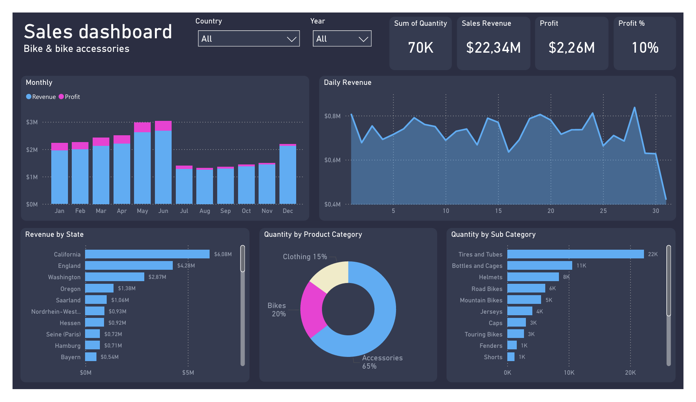

# Bike & bike accessories sales dashboard

This project showcases an interactive "**Bike & bike accessories sales dashboard**" created using **Power BI**. The dashboard visualizes key insights from a dataset analyzing customer spending habits to improve sales strategies.

The dataset used for this project is sourced from [Kaggle](https://www.kaggle.com/datasets/thedevastator/analyzing-customer-spending-habits-to-improve-sa). It provides insights into customer transactions, including key metrics such as revenue, cost, quantity, segmented across product categories and sub categories, various regions and timeframes (as no currency is provided, it would be assumed that the dataset uses USD).
 

## Tools Used
- **Power BI**: Dashboard creation and data visualization.
- **Dataset**: CSV files sourced from [Kaggle](https://www.kaggle.com/datasets/thedevastator/analyzing-customer-spending-habits-to-improve-sa).
